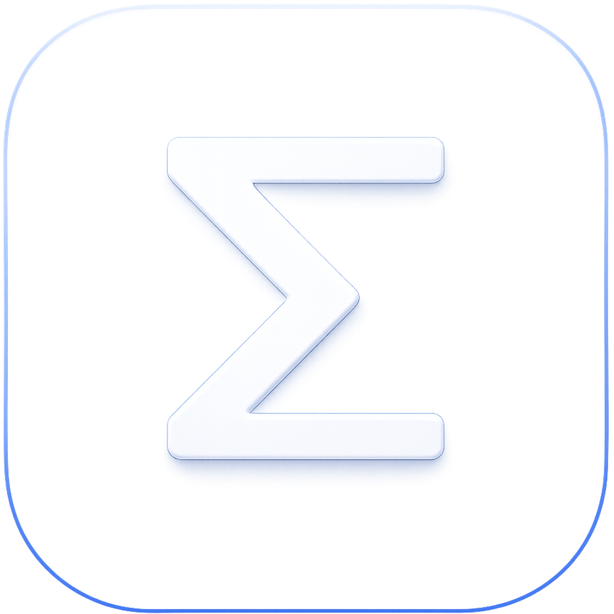
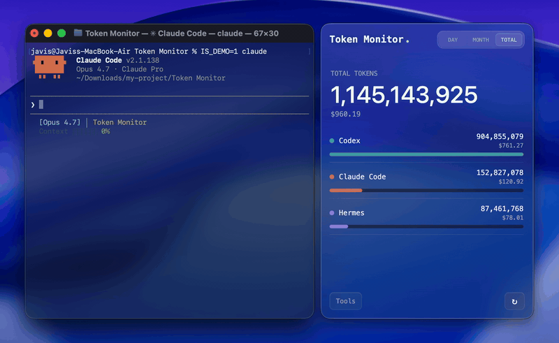
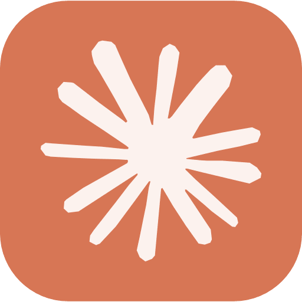
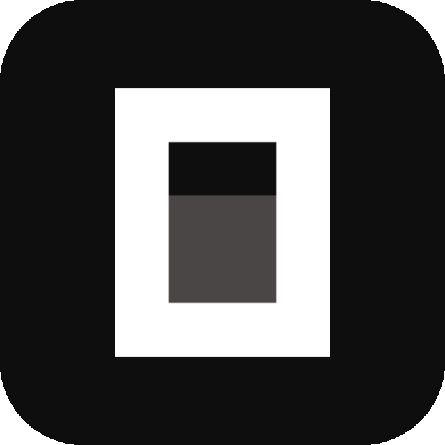
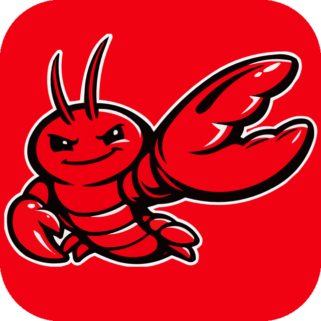
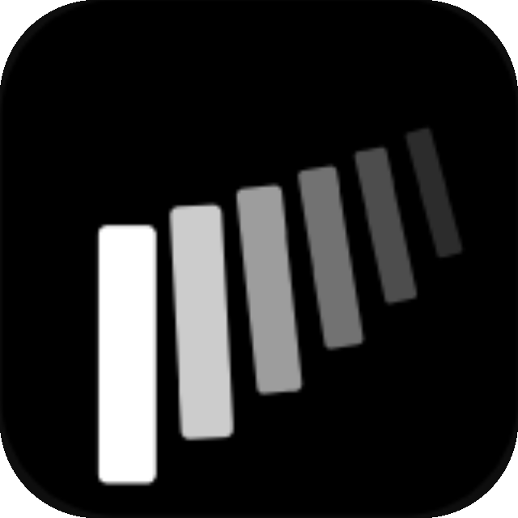
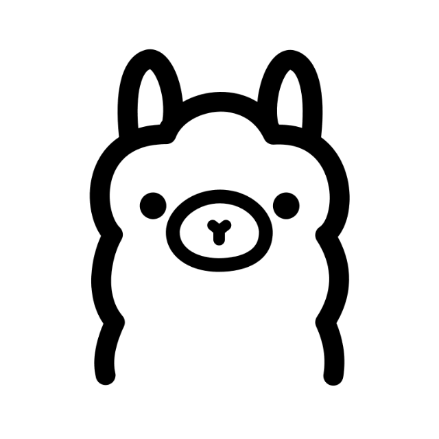

<p align="right">
   <strong>EN</strong> | <a href="./README.zh-CN.md">简</a> | <a href="./README.zh-TW.md">繁</a> | <a href="./README.ko.md">KO</a> | <a href="./README.ja.md">JA</a>
</p>
<div align="center">
    
    <h1>Token Monitor</h1>
</div>

<p align="center">
    <em>One live dashboard for every AI coding tool, synced across every machine.</em>
</p>

<p align="center">
    <a href="https://github.com/Javis603/token-monitor/releases"></a>
    <a href="https://github.com/Javis603/token-monitor/releases"></a>
    
    
    
    <a href="https://discord.gg/HmdNVVvw5P"></a>
    <a href="LICENSE"></a>
</p>

<div align="center">
    
</div>

## What is Token Monitor?

A desktop widget that shows live token usage and AI Tool Limits across various AI coding tools (Claude Code, Codex, Hermes Agent, OpenCode, OpenClaw, Cursor, Antigravity, Cline, and more) with real-time multi-device sync, historical usage trends, and breakdowns by tool, device, model, or session.

> This repository is forked from [Javis603/token-monitor](https://github.com/Javis603/token-monitor) and remains distributed under the original [MIT License](LICENSE). The original tokscale and CodexBar acknowledgments are retained below.

## Supported Tools

Token Monitor supports token usage, account-limit checks, and session details separately:

| Logo | Tool | Data path | Token Usage | AI Tool Limits | Session Details |
|:---:|------|-----------|:---:|:---:|:---:|
|  | Claude Code | `~/.claude/projects/`, `~/.claude/transcripts/` | ✅ | ✅ | ✅ |
|  | Codex | `~/.codex/sessions/` | ✅ | ✅ | ✅ |
|  | OpenCode | `~/.local/share/opencode/` | ✅ | ✅ | ✅ |
|  | Hermes Agent | `$HERMES_HOME/state.db` or `~/.hermes/state.db` | ✅ | — | — |
|  | OpenClaw | `~/.openclaw/agents/` | ✅ | — | — |
|  | Cursor | `~/.config/tokscale/cursor-cache/` (kept fresh by Cursor sync) | ✅ | ✅ | — |
|  | Antigravity | `~/.config/tokscale/antigravity-cache/` (kept fresh by Antigravity sync) | ✅ | ✅ | — |
|  | Cline | VS Code globalStorage tasks (`.../saoudrizwan.claude-dev/tasks/`) | ✅ | — | — |
|  | Kimi CLI / Kimi Code | `~/.kimi/sessions/`, `~/.kimi-code/sessions/` (`KIMI_CODE_HOME`); Kimi Code API key (Kimi Code quota via Kimi API) | ✅ | ✅ | — |
|  | Qwen CLI | `~/.qwen/projects/` | ✅ | — | — |
|  | Grok Build | `$GROK_HOME/sessions/` or `~/.grok/sessions/` | ✅ | ✅ | — |
|  | GitHub Copilot | VS Code `workspaceStorage/*/chatSessions/`, `~/.copilot/otel/` | ✅ | ✅ | — |
|  | Pi | `~/.pi/agent/sessions/`, `~/.omp/agent/sessions/` (Oh My Pi) | ✅ | — | — |
|  | Zed | `~/.local/share/zed/threads/threads.db` | ✅ | — | — |
|  | Kilo Code | VS Code globalStorage tasks (`.../kilocode.kilo-code/tasks/`) — Linux & remote/WSL only | ✅ | — | — |
|  | MiMo Code | `~/.local/share/mimocode/mimocode.db` | ✅ | ✅ | — |
|  | ZCode / GLM | `~/.zcode/projects/`; Z.ai API key (GLM personal/team Coding Plan quota via Z.ai API) | ✅ | ✅ | — |
|  | Kiro | `~/.kiro/sessions/cli/`, Kiro IDE globalStorage & `kiro-cli` DB | ✅ | ✅ | — |
|  | CodeBuddy | `~/.codebuddy/projects/` + IDE / VS Code extension logs | ✅ | — | — |
|  | WorkBuddy | `~/.workbuddy/projects/`, `~/.workbuddy/workbuddy.db` | ✅ | — | — |
|  | Proma | `~/.proma/agent-sessions/*.jsonl` | ✅ | — | — |
|  | DeepSeek | DeepSeek API key (balance via DeepSeek API) | — | ✅ | — |
|  | Minimax | Minimax API key (Token Plan quota via Minimax API) | — | ✅ | — |
|  | Volcengine | Ark API key or Volcengine AK/SK (Ark Coding Plan quota via Volcengine API) | — | ✅ | — |
|  | Qoder | Qoder dashboard cookie (big-model credits via Qoder usage API) | — | ✅ | — |
|  | Ollama | Ollama Cloud cookie (session/weekly usage via ollama.com/settings) | — | ✅ | — |

## Why Token Monitor?

Most usage monitors are useful on the machine they run on. Token Monitor is built for multi-device work: each device watches its own local logs, sends summary updates to your hub, and every connected widget sees token changes almost immediately.

## Features

- **Live token tracking** for Claude Code, Codex, Hermes Agent, OpenCode, OpenClaw, Cursor, Antigravity, Cline, Kimi, Qwen, Grok Build, GitHub Copilot, Pi, Zed, Kilo Code, MiMo Code, ZCode, Kiro, CodeBuddy, WorkBuddy, and Proma (UI updates within seconds of each turn)
- **WSL usage (Windows)** — usage from AI tools running inside a running WSL distro is detected automatically and merged into your totals (refreshed on the periodic scan, about every 5 minutes)
- **Real-time multi-device sync** over Server-Sent Events
- **Breakdown views** grouped by tool, device, model, session, or account limits
- **Per-session detail** — open a Claude Code, Codex, or OpenCode session to see tokens per prompt, expandable to each reply's exact token split and tools used (read on-demand from local transcripts or databases, never synced)
- **Cache hit statistics** — click on any tool or model to expand a detailed breakdown of input tokens (cache hit vs miss), output tokens, and hit rate percentages
- **Cost breakdown** alongside token counts
- **Cost in your currency** — show costs in USD, TWD, HKD, or CNY; exchange rates auto-update daily and can be manually overridden in Settings
- **Usage Trends & Dashboard** — a home-screen activity heatmap and trend chart, plus a dedicated dashboard window with streaks and stacked per-tool/per-model usage history (bar and K-line views) across all your devices
- **Data export** — export your usage as tool-agnostic CSV + JSON, manually or auto-written to a folder, for spreadsheets, Obsidian, Grafana, or scripts; see [docs/export.md](docs/export.md)
- **AI Tool Limits detection** for Claude Code, Codex, Cursor, Antigravity, OpenCode, Grok, Minimax, MiMo, GitHub Copilot, Kiro, GLM, Volcengine, Qoder, Kimi, and Ollama with provider-specific session, weekly, billing, and credits windows, plus DeepSeek prepaid balance and today/month spend. Tracked Codex accounts can be made the local Codex account in one click, without re-authenticating.
- **Optional Status view** for Claude, OpenAI, Cursor, and DeepSeek status pages, with manual or interval re-checks
- **Customizable tool list** to hide, pin, and reorder tools in the main dashboard without changing what gets tracked
- **Appearance controls** — interface theme switching (incl. a light mode), per-tool vendor colours, glass opacity, blur, and transparent window mode
- **Menu bar (macOS) and system tray (Windows) popover** with live cost, tokens, or closest Claude/Codex/Cursor/Antigravity/OpenCode/Grok/Minimax/MiMo/GitHub Copilot/Kiro/GLM/Volcengine/Qoder/Kimi/Ollama limit % next to the icon
- **Floating Bubble mode** that collapses the widget into a draggable mini-window with click or hover preview and tray-style content
- **Recordable global shortcut** to show or hide the window from anywhere
- **Local-first:** no servers needed for single-device use
- **Self-hosted sync backend** (in-widget hub, Node CLI hub, or Cloudflare Worker)
- **iOS widget support** via Widgy and Scriptable through the Worker hub
- **Discord Rich Presence** to broadcast today's tokens, cost, and top client (opt-in)
- **Privacy-first:** only summary numbers ever leave your machine

| Limits View | Devices View | Models View |
|:---:|:---:|:---:|
|  |  |  |

| Session View | Session Details | Service Status |
|:---:|:---:|:---:|
|  |  |  |

| Usage Dashboard — Overview | Usage Dashboard — Trends |
|:---:|:---:|
|  |  |

## Installation

Download from [GitHub Releases](https://github.com/Javis603/token-monitor/releases).

- **macOS (Apple Silicon)** — `.dmg`, signed and notarized
- **Windows 10/11** — setup `.exe`; signing is being prepared, so SmartScreen may appear
- **Linux x64** — `.AppImage`

Packaged builds check GitHub Releases automatically. When an update is available, the app shows an update indicator; supported platforms can also install from Settings → General.

### First run

Local mode is the default: launch the app and it starts tracking this device. No hub, agent, or config required.

## Multi-device sync

Pick ONE hub backend that all your devices (and any headless agents) connect to. On each device, open the widget and pick a mode under Settings → Multi-device Sync. The widget contributes this device's usage automatically; run `npm run agent` only on machines without a widget.

#### Option A — Host the hub from the widget (requires reachable MySQL)

In the widget on one always-on machine, configure the same `MYSQL_*` connection values that the Node hub uses, then open Settings → Multi-device Sync and pick **Host hub on this device**. The widget generates a random secret and lists the LAN URLs other devices can connect to (Tailscale or ZeroTier addresses appear here too). On every other device, pick **Connect to a hub** and paste the URL + secret. For a standalone deployment, the Compose option below is the recommended path.

The hub runs while Token Monitor is running — quitting (not just closing the window) stops it for all connected devices.

#### Option B — Self-hosted MySQL hub (always-on headless machine)

```bash
# on the always-on machine
cp .env.example .env
# Set TOKEN_MONITOR_SECRET, MYSQL_PASSWORD, and MYSQL_ROOT_PASSWORD to unique strong values, then:
docker compose up -d --build
```

The Compose stack runs MySQL 8.4 and the Node Hub, applies the versioned SQL migrations before the hub listens, and exposes port `17321` by default (`TOKEN_MONITOR_PORT` changes the host port). For a non-container deployment, install dependencies, set the same `MYSQL_*` variables, run `npm run migrate`, then run `npm run hub`.

The MySQL hub stores the latest normalized device snapshot to preserve the existing widget API, alongside an append-only `usage_events` ledger. Each ledger row is the change observed between device snapshots for a client/session/model combination, not an individual AI API request. Synchronized all-time payloads intentionally omit unbounded session maps; those aggregate entries are marked with `snapshot:<client>:<model>` session ids instead of claiming request-level provenance. Events use a MySQL `BIGINT` auto-increment id for efficient ordered audit queries. Events are never updated or removed automatically. Removing a device removes its live snapshot and mutable session rollup, but its historical event rows remain in the database with a null device foreign key.

Schema changes are reviewed SQL files in `migrations/`, applied by the small `npm run migrate` runner and recorded in `schema_migrations`. This keeps the original lightweight Node architecture without adding an ORM while retaining explicit, repeatable schema versions. The price catalog is unique by model because the public Hub route and tokscale's upstream lookup are model-based; an event copies the resolved values instead of referencing the mutable catalog row.

Model prices are configured through the hub API and copied into every event at ingest time. Later price changes do not alter historical event costs. If a model has no configured price, the hub records the payload's tokscale `costUsd` delta with `pricingSource: "payload_fallback"` rather than inventing a zero cost.

The upstream pricing action calls `tokscale pricing` first. If tokscale cannot retrieve its complete upstream catalog (for example, a host blocks `raw.githubusercontent.com`), the Hub falls back to `models.dev`, another catalog tokscale consults. That catalog is held in the Hub process for six hours and the resolved price is then persisted in `model_pricing`; set `TOKSCALE_PRICING_CATALOG_URL` only when an equivalent HTTPS catalog mirror is required.

#### Option C — Cloudflare Worker hub (across networks, including iPhone)

[](https://deploy.workers.cloudflare.com/?url=https://github.com/Javis603/token-monitor/tree/main/worker)

One-click deploy — Cloudflare will prompt for the `TOKEN_MONITOR_SECRET` during setup. Or deploy manually:

```bash
cd worker
npm install
npx wrangler login
npx wrangler secret put TOKEN_MONITOR_SECRET
npx wrangler deploy
```

Paste the deployed URL into each device's widget at Settings → Multi-device Sync. See [worker/README.md](worker/README.md) for the iOS widget recipe and endpoint reference, or [docs/API.md](docs/API.md) for the hub HTTP API.

The Cloudflare Worker remains on its existing non-MySQL storage implementation in this branch. It keeps the prior protocol but does not expose the MySQL pricing or event-ledger features.

## App data

App state lives in the OS user-data dir — delete it along with the app to fully uninstall.

| Platform | Path |
|----------|------|
| macOS | `~/Library/Application Support/Token Monitor/` |
| Windows | `%APPDATA%/Token Monitor/` |
| Linux | `~/.config/Token Monitor/` |

## Build from source

To build your own installer, use Node.js 22.13+ on the **target** OS (electron-builder can't cross-build a macOS `.dmg` on Windows, or vice-versa).

```bash
npm install
npm run dist:mac   # macOS arm64 .dmg          → dist/
npm run dist:win   # Windows x64 installer .exe → dist/
npm run dist:linux # Linux x64 AppImage        → dist/
npm run pack       # unpacked app dir (no installer), for quick local testing
```

Output lands in `dist/`. Windows and Linux use the matching `dist:*` script above on the target OS. Packaging the macOS release build requires a local Developer ID Application signing identity; use `npm start` for local development or unsupported platforms.

### MySQL hub tests

The normal `npm test` suite runs fast unit coverage without a database. For the MySQL integration test, configure the `MYSQL_TEST_*` values in `.env`, then run:

```bash
docker compose -f docker-compose.test.yml up -d
npm run test:mysql
```

For a full deploy check after `docker compose up -d --build`, export `TOKEN_MONITOR_SECRET` and run `./scripts/smoke-test.sh`. The script posts a representative ingest snapshot, verifies `/api/stats`, writes a manual model price, then asks tokscale for the same model's upstream price (using the documented catalog fallback if the CLI's complete upstream chain is unavailable).

## How it works

```text
Mode A — Local (default, no setup)
    widget (Electron) ──▶ tokscale ──▶ ~/.claude, ~/.codex, $HERMES_HOME

Mode B — Sync (opt-in, multi-device)
    device A agent ──▶
    device B agent ──▶  hub  ──▶  widget on any device
    device C agent ──▶
```

The widget chooses local vs sync mode based on Settings → Multi-device Sync. The hub itself can run as a separate `npm run hub` process, a Cloudflare Worker, or directly inside one of the widgets (Host mode). In sync mode the hub pushes aggregated stats to every connected widget over Server-Sent Events, so updates on one device appear on the others within a few seconds.

## Session data retention

The activity heatmap and trends dashboard are built from the session files each tool still keeps on disk. **Claude Code prunes its own transcripts after 30 days by default** (`cleanupPeriodDays`). With **Preserve deleted session usage** enabled (Settings → Collection), Token Monitor retains all daily client/model observations it has already seen locally, alongside Today/Month/All-time session totals. The heatmap and sync payload still use a rolling 370-day window, while older observations remain available locally for future views. Later source cleanup therefore no longer erases an observed day, but data deleted before Token Monitor first observed it cannot be recovered by this archive.

To keep the heatmap's full rolling year, raise Claude Code's retention in `~/.claude/settings.json` before the window passes:

```json
{
  "cleanupPeriodDays": 370
}
```

370 matches the heatmap's window; a larger value keeps more, at the cost of transcripts living on disk for as long as you set. tokscale's [Session Data Retention](https://github.com/junhoyeo/tokscale#session-data-retention) table covers the other tools' defaults and config paths.

## Settings

### Widget (GUI)

Click the `⚙` button in the widget header to open the Settings panel.

- **Multi-device Sync** — three modes: **Local only** (this device, no hub), **Connect to a hub** (paste another machine's Hub URL + secret), or **Host hub on this device** (open a hub here so other devices can connect; LAN/Tailscale/ZeroTier addresses are listed for you).
- **Tracked Tools** — choose which AI tools are collected, and independently hide, pin, or reorder tools in the main list.
- **AI Tool Limits** — choose Claude Code, Codex, Cursor, Antigravity, OpenCode, DeepSeek, Grok, Minimax, MiMo, GitHub Copilot, Kiro, GLM, Volcengine, Qoder, Kimi, and Ollama limit detection and refresh frequency.
- **Trends** — choose the scan interval for daily usage history, or turn it off; open the Usage Dashboard for the activity heatmap, streaks, and stacked per-tool/per-model bar and K-line charts.
- **Window behavior** — choose floating above apps, a normal window, or desktop pinned mode.
- **Tray Mode** — switch to a menu bar (macOS) or system tray (Windows) popover and choose what shows next to the icon: cost, today's tokens, total tokens, cost + tokens, the closest Claude/Codex/Cursor/Antigravity/OpenCode/Grok/Minimax/MiMo/GitHub Copilot/Kiro/GLM/Volcengine/Qoder/Kimi/Ollama limit % left, or icon-only.
- **Floating Bubble** — collapse the widget into a draggable mini-window, reopen it by click or hover preview, and choose bubble content from icon, tokens, cost, or AI Tool Limit bars.
- **Shortcut** — record a global shortcut to show or hide the window.
- **Appearance** — switch the interface theme between presets (Default, Obsidian, and a Porcelain light mode) or your own custom colours (accent, background, text, muted), set per-tool vendor colours, system glass, live dot, tool icons, Discord Rich Presence, glass opacity, and glass blur.
- **Advanced** — opens the underlying `settings.json` for less-common options like `allTimeSince`.

The pin button in the widget header toggles "always on top".

### Headless agent and hub (`.env`)

The agent and hub have no UI. Configure them with a `.env` file at the project root (copy from `.env.example`):

```env
TOKEN_MONITOR_HUB_URL=               # required for sync mode — Worker URL or http://<lan-ip>:17321
TOKEN_MONITOR_SECRET=                # shared secret, must match the hub
TOKEN_MONITOR_DEVICE_ID=             # optional — defaults to hostname
TOKEN_MONITOR_SYNC_UPLOAD_INTERVAL_MS= # optional — 0/live, 600000/10m, 1200000/20m, 1800000/30m
TOKEN_MONITOR_CLIENTS=               # optional — defaults to all supported tools; set empty to disable tracking
TOKEN_MONITOR_PROJECTS_ENABLED=      # optional — defaults to disabled; set to 1 to collect project metadata
TOKEN_MONITOR_HISTORY_ENABLED=       # optional — defaults to enabled; set to 0 to skip collecting Trends history
TOKEN_MONITOR_SESSION_USAGE_ARCHIVE_ENABLED= # optional — defaults to enabled; set to 0 to stop preserving archived session usage
TOKEN_MONITOR_LIMITS_ENABLED=        # optional — defaults to enabled; set to 0 to skip CLI probing
TOKEN_MONITOR_LIMIT_PROVIDERS=       # optional — defaults to all supported (claude, codex, cursor, antigravity, opencode, deepseek, minimax, mimo, grok, copilot, kiro, zai, zaiteam, volcengine, qoder, kimi, ollama)
```

See `.env.example` for the full list. The widget uses env values as first-run defaults; CLI flags take precedence for the agent and hub.

Example one-off run:

```bash
npm run agent -- --clients=claude,codex,opencode --once
```

## Privacy

The hub and agent only transmit summary fields:

- device id, hostname, platform
- total tokens per period (today / month / all-time)
- cost totals (when `tokscale` returns cost data)
- per-client and per-model breakdowns
- normalized Claude Code/Codex/Cursor/Antigravity/OpenCode/Grok/Minimax/MiMo/GitHub Copilot/Kiro/GLM/Volcengine/Qoder/Kimi/Ollama limit status when AI Tool Limits is enabled

They do not transmit raw AI logs, prompts, source code, or conversation
content. They also do not transmit OAuth credentials, access tokens, refresh
tokens, emails, or raw provider responses. `.env`, `data/`, and `node_modules/`
are gitignored.

## Requirements

- macOS, Windows, or Linux x64
- Node.js 22.13+
- For sync mode only: network reachability from each agent/widget to the hub

## Star History

<a href="https://www.star-history.com/?repos=Javis603%2Ftoken-monitor&type=date&legend=top-left">
 <picture>
   <source media="(prefers-color-scheme: dark)" srcset="https://api.star-history.com/chart?repos=Javis603/token-monitor&type=date&theme=dark&legend=top-left&sealed_token=VEcaPQSNlH8coYjuILJy7eT6t-pGJrGDEjOAjVwP8WGwNBOeNXoLTcz-KVBaZ2Y8eSqG1tLEpWGF3-5eMvVhW5G8n1ckdYI_uMZ6UCBE7b_eANd6we__7g7yc4ShXemuWfi-8SRcxgJNLK12VZGgBIccY1ceI3T3xm7jBM1TJjTVQFWJ0MmX2e-7QBp9" />
   <source media="(prefers-color-scheme: light)" srcset="https://api.star-history.com/chart?repos=Javis603/token-monitor&type=date&legend=top-left&sealed_token=VEcaPQSNlH8coYjuILJy7eT6t-pGJrGDEjOAjVwP8WGwNBOeNXoLTcz-KVBaZ2Y8eSqG1tLEpWGF3-5eMvVhW5G8n1ckdYI_uMZ6UCBE7b_eANd6we__7g7yc4ShXemuWfi-8SRcxgJNLK12VZGgBIccY1ceI3T3xm7jBM1TJjTVQFWJ0MmX2e-7QBp9" />
   
 </picture>
</a>

## Contributing

Issues and PRs are welcome. Project conventions, architecture notes, and the command reference live in [AGENTS.md](AGENTS.md) — written for coding agents, but it doubles as the contributor guide.

## Acknowledgments

- [tokscale](https://github.com/junhoyeo/tokscale) for log parsing and token accounting.
- [CodexBar](https://github.com/steipete/CodexBar) for AI Tool Limits research.

## License

[MIT](LICENSE) © [@Javis](https://github.com/Javis603)
